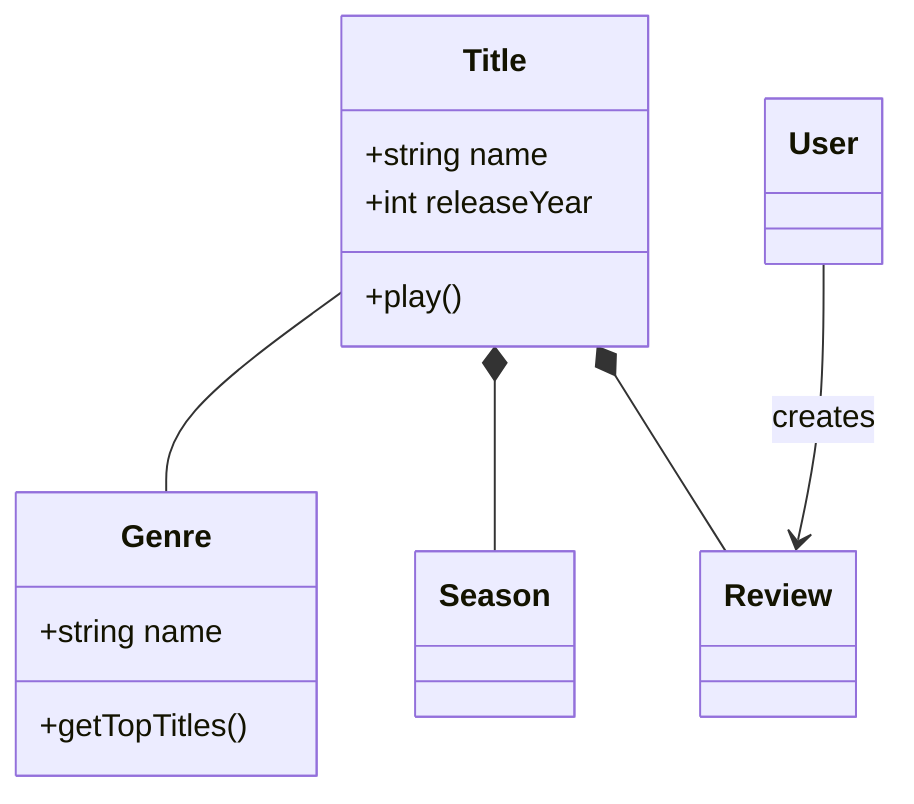
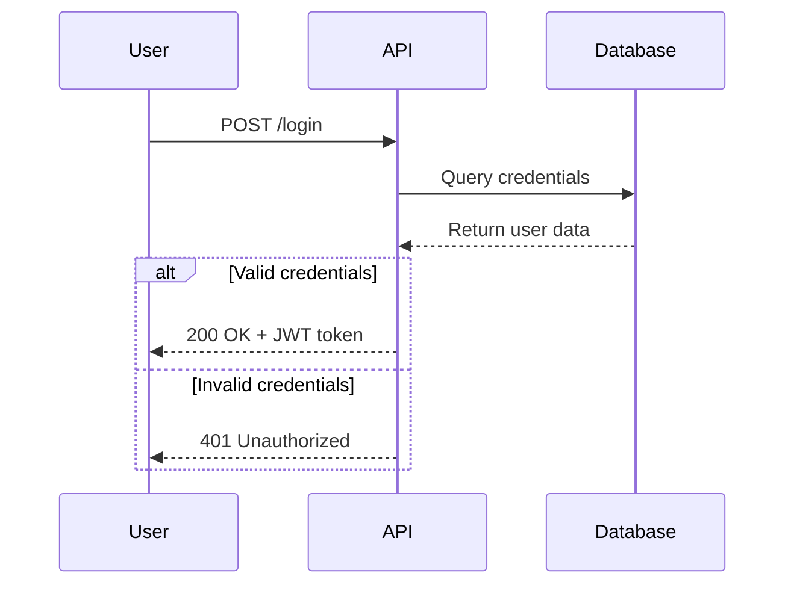
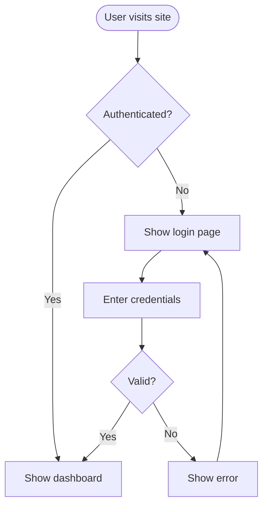
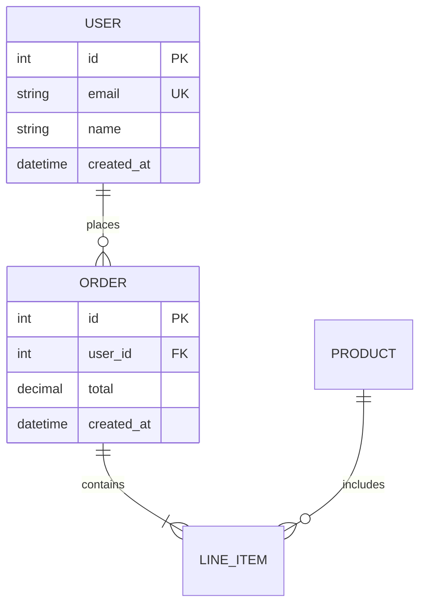

# Quick Start Examples

## Class Diagram (Domain Model)

```mermaid
classDiagram
    Title -- Genre
    Title *-- Season
    Title *-- Review
    User --> Review : creates

    class Title {
        +string name
        +int releaseYear
        +play()
    }

    class Genre {
        +string name
        +getTopTitles()
    }
```

## Sequence Diagram (API Flow)

```mermaid
sequenceDiagram
    participant User
    participant API
    participant Database

    User->>API: POST /login
    API->>Database: Query credentials
    Database-->>API: Return user data
    alt Valid credentials
        API-->>User: 200 OK + JWT token
    else Invalid credentials
        API-->>User: 401 Unauthorized
    end
```

## Flowchart (User Journey)

```mermaid
flowchart TD
    Start([User visits site]) --> Auth{Authenticated?}
    Auth -->|No| Login[Show login page]
    Auth -->|Yes| Dashboard[Show dashboard]
    Login --> Creds[Enter credentials]
    Creds --> Validate{Valid?}
    Validate -->|Yes| Dashboard
    Validate -->|No| Error[Show error]
    Error --> Login
```

## ERD (Database Schema)

```mermaid
erDiagram
    USER ||--o{ ORDER : places
    ORDER ||--|{ LINE_ITEM : contains
    PRODUCT ||--o{ LINE_ITEM : includes

    USER {
        int id PK
        string email UK
        string name
        datetime created_at
    }

    ORDER {
        int id PK
        int user_id FK
        decimal total
        datetime created_at
    }
```
